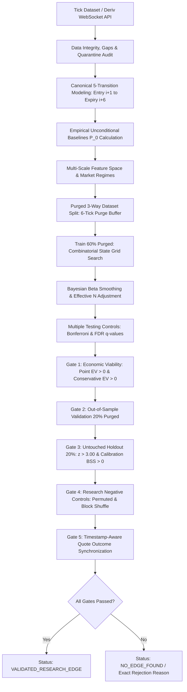

# Deriv 5-Tick Quantitative Research & Real-Market Validation Framework (V1.5)


%20%7C%20gaps%20%7C%20quarantine-green)


-red)


A quantitative research and statistical validation framework engineered for Deriv 5-tick contracts, specifically modeling RUNHIGH (Only Ups) and RUNLOW (Only Downs) where every successive tick after the entry spot must move strictly in the chosen direction. The framework formulates trading as a multi-stage statistical hypothesis testing and probability calibration problem: determining under which measurable market conditions, if any, the probability of winning exceeds the break-even probability implied by its actual available payout by a statistically credible and repeatable margin.

---

## Canonical 5-Tick Contract Execution Lifecycle

The production research definition enforces a single canonical contract duration implementation:

```
Signal detected at tick i
       |
Order submitted & processed
       |
Entry Spot S_0 = tick i + 1 (First tick after processing)
       |
  Step 1: S_0 -> S_1 (tick i + 2)
  Step 2: S_1 -> S_2 (tick i + 3)
  Step 3: S_2 -> S_3 (tick i + 4)
  Step 4: S_3 -> S_4 (tick i + 5)
  Step 5: S_4 -> S_5 (tick i + 6, Expiry Spot)
```

### Strict Settlement Rules
- **RUNHIGH (Only Ups)**: Wins if and only if $S_1 > S_0 \land S_2 > S_1 \land S_3 > S_2 \land S_4 > S_3 \land S_5 > S_4$.
- **RUNLOW (Only Downs)**: Wins if and only if $S_1 < S_0 \land S_2 < S_1 \land S_3 < S_2 \land S_4 < S_3 \land S_5 < S_4$.
- **Equality**: Any equality ($=$) at any step results in an immediate contract loss.
- **Reversals**: Any opposing directional tick results in an immediate loss.
- **Insufficient Forward Ticks**: Evaluates to `None` or `NaN`, preventing fabricated outcomes.

---

## Empirical Baseline vs Proposal Benchmark

The engine does not assume theoretical random-walk probability ($3.125\%$). It computes the empirical baseline from historical observations:

$$\text{Theoretical Reference} = (0.5)^5 = 0.03125 = 3.125\%$$

$$\text{Deriv Live Proposal Hurdle (\$2.00 Stake } \to \text{\$61.03 Total Payout)} = \frac{\$2.00}{\$61.03} \approx 3.277\%$$

Empirical results on Volatility 75 (`R_75`, 43,184 ticks, 43,178 contract windows):
- **Empirical $P(\text{RUNHIGH})$**: $3.275\%$ ($SE = 0.0009$, $95\%$ Wald CI: $[3.107\%, 3.443\%]$)
- **Empirical $P(\text{RUNLOW})$**: $2.971\%$ ($SE = 0.0008$, $95\%$ Wald CI: $[2.811\%, 3.132\%]$)

---

## V1.5 Advanced Statistical & Gating Architecture



---

## V1.5 Methodological Advancements

### 1. Purged Split Boundaries
Sliding 5-tick contracts overlap forward in time. When evaluating the final tick of the Training set ($i$), its forward outcome extends to $i+6$. Without a purge buffer, forward outcomes would leak across dataset boundaries into the Validation set. V1.5 enforces a 6-tick purge gap (`create_purged_three_way_split(purge_gap=6)`), guaranteeing zero boundary cross-contamination.

### 2. Bayesian Probability Smoothing
To prevent low-sample false anomalies from being mistaken for edges, V1.5 applies conjugate Beta prior shrinkage centered on the empirical base rate $P_0$:
$$P_{\text{Bayes}} = \frac{k + M \cdot P_0}{n + M}$$
where $M=50$. A state with 2 wins in 10 observations (nominal $20\%$) shrinks to $6.0\%$, preventing small-sample artifacts from passing discovery.

### 3. Effective Sample Size for Overlapping Contracts
Because consecutive 5-tick contract windows share 4 transitions, treating every tick as an independent sample artificially deflates standard errors by $\sqrt{5} \approx 2.24\times$. V1.5 reports both nominal sample size $n$ and cluster-adjusted effective sample size ($N_{\text{eff}} \approx n / 5$), protecting against inflated test statistics.

### 4. Conservative Expected Value
In addition to point-estimate EV, the engine evaluates Conservative EV using the lower $95\%$ Wilson score confidence bound $P_{\text{lower}}$:
$$\text{Conservative\_EV} = P_{\text{lower}} \times \text{payout} - \text{stake}$$
If $\text{Conservative\_EV} \le 0$, the opportunity is flagged as lacking an adequate statistical margin of safety.

### 5. Research Negative Controls
`negative_control.py` subjects the discovery engine to randomized state labels and stationary block-shuffled price increments. The framework measures the empirical False Positive Rate (FPR) under the null hypothesis, verifying that the multi-gate pipeline rejects noise and discovers zero false-positive edges on null data.

### 6. Live Proposal Quote Recorder
`quote_recorder.py` queries Deriv's public WebSocket API for live RUNHIGH and RUNLOW proposals without purchasing contracts. It records request/response timestamps, latency in milliseconds, ask prices, payouts, net profits, and proposal IDs, writing to `data/<symbol>_quotes.csv`.

---

## Directory Structure

```
bot_builder/
├── config.py                   # Configuration, proposal parameters & live payout query
├── collector.py                # Tick downloader with checkpoint recovery, gaps & quarantine
├── merge_ticks.py              # Master tick merger, deduplication & conflict halt
├── contract_model.py           # Canonical Deriv RUNHIGH/RUNLOW lifecycle (Entry i+1 -> Expiry i+6)
├── quote_engine.py             # Direction-specific quote engine & historical stream lookup
├── quote_recorder.py           # Dedicated live proposal quote recorder (Zero buy orders)
├── dataset_synchronizer.py     # Timestamp-aware synchronizer with strict lookahead protection
├── negative_control.py         # Research negative controls (Permuted states & block shuffle)
├── market_regime.py            # Expanded features: streaks, momentum exhaustion, volatility transitions
├── features.py                 # Feature pipeline, data validation & historical coverage checks
├── strategy.py                 # MarketStateProbabilityModel & setup scoring
├── feature_search.py           # SystematicStateGridSearch, SampleSizeConfig, EdgeCandidateReport
├── probability.py              # Bayesian smoothing, Wilson CIs, FDR q-values, Effective N, EV
├── paper_trader.py             # Safe paper trading engine (LIVE_EXECUTION_DISABLED = True)
├── risk.py                     # Consecutive-loss cooldowns & UTC daily loss reset
├── backtest.py                 # Probability-driven backtester with quote stream lookup
├── walk_forward.py             # Purged 3-way split (Train 60% / Val 20% / Holdout 20%)
├── trade_journal.py            # Granular trade database & performance attribution
├── research.py                 # Cross-sectional multi-symbol hypothesis tester
├── run_edge_research.py        # Single research command executing full 13-stage V1.5 pipeline
├── dashboard.py                # Local web dashboard with 60-30-10 UI (http://127.0.0.1:8088)
├── requirements.txt            # Project dependency manifest
├── tests/                      # Automated test suite (51 passed)
│   ├── test_outcome_rule.py        # Validates entry i+1, exit i+6, ties count as losses
│   ├── test_no_lookahead.py        # Proves zero lookahead bias when future prices change
│   ├── test_null_test.py           # Null hypothesis shuffle test (collapses to baseline)
│   ├── test_risk_and_validation.py # Validates cooldowns, daily resets & integrity audits
│   ├── test_merge_ticks.py         # Validates deduplication, price conflict stop & gaps
│   ├── test_v11_engine.py          # Validates contract model, quotes, walk-forward
│   ├── test_runhigh_runlow.py      # Validates exact 5-transition RUNHIGH/RUNLOW mechanics
│   ├── test_v13_edge_discovery.py  # Validates grid search, lift, Brier score, BSS, ECE
│   ├── test_v14_edge_validation.py # Validates 7-gate attribution, true break-even, paper mode
│   └── test_v15_advanced_validation.py # Validates purged splits, Bayesian shrinkage, Wilson CIs,
│                                       # conservative EV, effective N, FDR, quote recorder,
│                                       # synchronizer, negative controls, and collector recovery
└── data/                       # Historical tick storage & provenance logs
    ├── .gitkeep
    ├── <symbol>_ticks.csv
    ├── <symbol>_master.csv
    ├── <symbol>_provenance.json
    ├── <symbol>_master_provenance.json
    └── quarantine/             # Quarantined corrupt/unverified datasets
        ├── .gitkeep
        └── quarantine_log.json
```

---

## Research Execution Commands

### 1. Run Complete Offline Research Pipeline (V1.5)
```bash
python run_edge_research.py data/R_75_master.csv
```

### 2. Run Multi-Symbol Comparative Scan
```bash
python run_edge_research.py --all-symbols
```

### 3. Run Safe Paper Trading Simulation
```bash
python run_edge_research.py data/R_75_master.csv --paper
```

### 4. Record Live Proposal Quotes (Offline / Online)
```bash
python quote_recorder.py R_75 --duration 60 --interval 2
```

### 5. Collect Additional Historical Ticks with Checkpoints
```bash
python collector.py R_75 500000
```

### 6. Launch Visual Research Dashboard
```bash
python dashboard.py 8088
```
Navigate to `http://127.0.0.1:8088`.

---

## Running Automated Tests

Run the complete 51-test regression suite:

```bash
python -m pytest -v
```

All 51 unit tests execute locally in under 3 seconds without requiring live network access.

---

## Sample Research Output (V1.5)

```
================================================================================
                     EDGE RESEARCH REPORT (V1.5)
================================================================================
Symbol:                 R_75
Contract:               RUNHIGH (Only Ups) & RUNLOW (Only Downs)
Duration:               5 ticks (S_0 at i+1 -> S_5 at i+6, 5 consecutive transitions)
Historical Coverage:    43,184 ticks | 1.00 days (43,178 contract windows)
--------------------------------------------------------------------------------
Baseline:
  Theoretical Benchmark:   3.125% ((0.5)^5)
  Empirical P(RUNHIGH):    3.275% [95% CI: 3.107%, 3.443%] (SE: 0.0009, n=43,178)
  Empirical P(RUNLOW):     2.971% [95% CI: 2.811%, 3.132%] (SE: 0.0008, n=43,178)
  Live Proposal Hurdle:    3.277% (Stake $2.00 -> Payout $61.03)
--------------------------------------------------------------------------------
Best Discovered State:  mom_bin=STRONG_BULL & streak_bin=EXTREME_UP_STREAK & vol_bin=NORMAL_VOL & accel_bin=DECELERATING

Training (60% Purged):
  Sample Size (n):      77 (Effective N_eff: 15.4 adj. for 5-tick overlap)
  P(RUNHIGH | state):   9.09%
  Bayesian Smoothed P:  6.80% (Beta prior shrinkage toward base rate)
  Relative Lift:        2.73x over empirical baseline
  Absolute Lift:        +5.77%
  Statistical Edge:     +5.81%
  Wilson 95% CI:        [4.47%, 17.60%]
  Wald 95% CI:          [2.67%, 15.51%]
  Raw p-value:          0.002082
  Adjusted p-value:     1.000000 (Bonferroni across 874 tests)
  Significance Status:  NOT_SIGNIFICANT

Validation (20% Purged):
  P(RUNHIGH | state):   3.23%
  Realized Edge:        -0.05%
  Validation Status:    FAILED_VALIDATION

Holdout (20% - The Honest Exam):
  P(RUNHIGH | state):   2.56%
  Sample Size (n):      39
  Realized Edge:        -0.71%
  Holdout z-score:      -0.25 (Required: z > 3.00)
  Holdout Status:       FAILED_HOLDOUT

Break-even:
  Required Win Rate:    3.28%

Expected Value Engine:
  Point-Estimate EV:    $+3.55 ($+1.774 per $1 stake)
  Conservative EV:      $+0.73 (evaluated at lower 95% CI bound)

Calibration:
  Model Brier Score:    0.032617
  Baseline Brier Score: 0.032598
  Brier Skill Score:    -0.0006 (Positive required for true forecast skill)
  Calibration ECE:      0.0013
  Calibration Status:   POOR_CALIBRATION

Research Negative Controls:
  Permuted False Positives: 26 / 111
  Empirical Null FPR:       23.42%
  Control Gate Status:      FAILED

Statistical Significance:
  Family-wise Threshold: z >= 4.02
  Holistic Status:      NOT_SIGNIFICANT
--------------------------------------------------------------------------------
Final Status:
  STATUS: [NOT_SIGNIFICANT] -> NO EDGE FOUND
  The statistical evidence does NOT demonstrate an exploitable edge after realistic
  Deriv payout conditions are applied. The bot will NOT trade (Strict NO_TRADE state).
================================================================================
```
