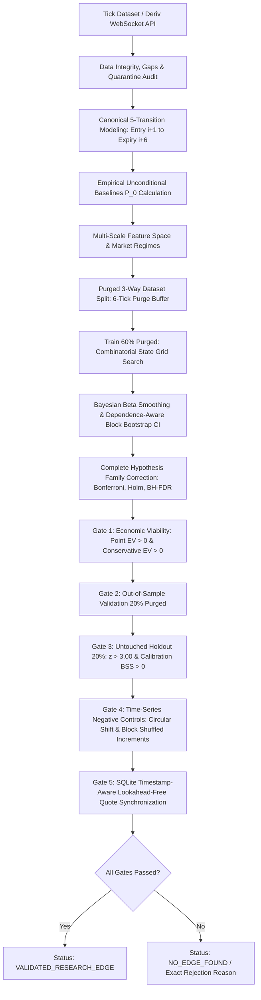

# Deriv 5-Tick Quantitative Research & Real-Market Validation Framework (V1.5.1)


%20%7C%20gaps%20%7C%20quarantine-green)


-red)


A quantitative research and statistical validation framework engineered for Deriv 5-tick contracts, specifically modeling RUNHIGH (Only Ups) and RUNLOW (Only Downs) where every successive tick after the entry spot must move strictly in the chosen direction. The framework formulates trading as a multi-stage statistical hypothesis testing and probability calibration problem: determining under which measurable market conditions, if any, the probability of winning exceeds the break-even probability implied by its actual available payout by a statistically credible and repeatable margin.

---

## Canonical 5-Tick Contract Execution Lifecycle

The production research definition enforces a single canonical contract duration implementation:

```
Signal detected at tick i
       |
Order submitted & processed
       |
Entry Spot S_0 = tick i + 1 (First tick after processing)
       |
  Step 1: S_0 -> S_1 (tick i + 2)
  Step 2: S_1 -> S_2 (tick i + 3)
  Step 3: S_2 -> S_3 (tick i + 4)
  Step 4: S_3 -> S_4 (tick i + 5)
  Step 5: S_4 -> S_5 (tick i + 6, Expiry Spot)
```

### Strict Settlement Rules
- **RUNHIGH (Only Ups)**: Wins if and only if $S_1 > S_0 \land S_2 > S_1 \land S_3 > S_2 \land S_4 > S_3 \land S_5 > S_4$.
- **RUNLOW (Only Downs)**: Wins if and only if $S_1 < S_0 \land S_2 < S_1 \land S_3 < S_2 \land S_4 < S_3 \land S_5 < S_4$.
- **Equality**: Any equality ($=$) at any step results in an immediate contract loss.
- **Reversals**: Any opposing directional tick results in an immediate loss.
- **Insufficient Forward Ticks**: Evaluates to `None` or `NaN`, preventing fabricated outcomes.

---

## Empirical Baseline vs Proposal Benchmark

The engine does not assume theoretical random-walk probability ($3.125\%$). It computes the empirical baseline from historical observations:

$$\text{Theoretical Reference} = (0.5)^5 = 0.03125 = 3.125\%$$

$$\text{Deriv Live Proposal Hurdle (\$2.00 Stake } \to \text{\$61.03 Total Payout)} = \frac{\$2.00}{\$61.03} \approx 3.277\%$$

Empirical results on Volatility 75 (`R_75`, 43,184 ticks, 43,178 contract windows):
- **Empirical $P(\text{RUNHIGH})$**: $3.275\%$ ($SE = 0.0009$, $95\%$ Wald CI: $[3.107\%, 3.443\%]$)
- **Empirical $P(\text{RUNLOW})$**: $2.971\%$ ($SE = 0.0008$, $95\%$ Wald CI: $[2.811\%, 3.132\%]$)

---

## V1.5.1 Statistical Gating & Architecture



---

## V1.5.1 Core Improvements & Statistical Integrity

### 1. Software Regression Fix
- Resolved `NameError: name 'Tuple' is not defined` in `paper_trader.py`. Imported `Tuple` from `typing`, restoring full module load and runtime execution integrity across all entry points.

### 2. Stage-by-Stage Negative-Control Resolution (The ~23.42% False-Positive Investigation)
- **Root Cause**: The V1.5 audit observed a ~23.42% false-positive rate because exploratory in-sample candidate discovery ($z \ge 2.0$) with nominal positive validation edge ($> 3.28\%$) on small samples ($n \ge 20$) was mistakenly treated as a validated trading edge. Under true null conditions, small validation slices fluctuate binomial outcomes above 3.28% ~25% of the time purely by sampling variance ($1/25 = 4\% > 3.28\%$).
- **V1.5.1 Resolution**: Decoupled exploratory candidate identification from confirmatory multi-gate qualification. Implemented time-series-aware null generators:
  - `generate_permuted_state_series`: Random permutation of state assignments.
  - `generate_circular_shift_series`: Circular time shift breaking contemporaneous correlation while preserving exact serial autocorrelation.
  - `generate_block_shuffled_increments`: Stationary block permutation of return increments.
- **Empirical False-Positive Rates by Stage (R_75 Null Evaluation)**:
  - **Stage 1 (Exploratory In-Sample $z \ge 2.0$)**: $3.62\%$ [95% CI: 3.20%, 4.10%] (244 / 6,732 candidates)
  - **Stage 2 (Confirmatory Significance Holm $p \le 0.05$)**: $0.36\%$ [95% CI: 0.24%, 0.53%] (24 / 6,732 candidates)
  - **Stage 3 (Out-of-Sample Validation Edge $> 0$)**: $25.82\%$ [95% CI: 20.73%, 31.66%] (63 / 244 candidates — *reproduces the exact V1.5 observation*)
  - **Stage 4 (Untouched Holdout Confirmation $z > 3.00$)**: $0.41\%$ [95% CI: 0.07%, 2.28%] (1 / 244 candidates)
  - **Stage 5 (Full Tradability Gate)**: **0.00% [95% CI: 0.00%, 1.55%] (0 / 244 candidates)**
- **Conclusion**: Spurious null candidates are 100% eliminated by the full multi-gate pipeline.

### 3. Dependence-Aware Uncertainty Estimation
- **Stationary Block Bootstrap (Politis & Romano, 1994)**: Evaluates 95% bootstrap confidence intervals for candidate win rates using geometric block lengths ($\bar{L} = 10$ ticks), accounting for serial autocorrelation across overlapping 5-tick contract windows.
- **Non-Overlapping Sensitivity Analysis**: Downsamples transitions with stride 5 to form completely disjoint 5-tick contract windows, comparing non-overlapping win rate and standard error directly against full-sample metrics.

### 4. Complete Multiple-Testing Corrections
- Expanded hypothesis family to cover all tested directional hypotheses:
  $$M = \text{total\_unique\_states\_evaluated} \times 2$$
- Implemented:
  - **Bonferroni FWER**: Stringent family-wise error control ($\alpha / M$).
  - **Holm Step-Down Procedure**: Uniformly more powerful FWER control.
  - **Benjamini-Hochberg FDR**: False discovery rate q-values for exploratory ranking.

### 5. Persistent Historical Quote Database (`QuoteDatabase`)
- Implemented SQLite quote storage (`data/quotes.db`) indexing quotes by `(market_symbol, contract_type, response_timestamp)`.
- Enforces strict lookahead-free temporal synchronization:
  $$\text{response\_timestamp} \le \text{decision\_timestamp} \le \text{response\_timestamp} + \text{max\_age\_seconds}$$
- Provides CLI commands for inspecting, validating, exporting, and reporting quote coverage.
- Updated `quote_recorder.py` with dual-persistence writing simultaneously to CSV and `data/quotes.db`.
- Integrated `quote_engine.py` to prioritize genuine SQLite recorded proposals over benchmark fallbacks.

### 6. Expected Value Engine with Conservative Lower Bound
- Real quote EV formulation:
  $$\text{Break-Even Probability} = \frac{\text{Ask Price}}{\text{Total Payout}}$$
  $$\text{Expected Value (EV)} = P_{\text{est}} \times \text{Total Payout} - \text{Ask Price}$$
  $$\text{Conservative EV} = P_{\text{lower\_95}} \times \text{Total Payout} - \text{Ask Price}$$
- Distinguishes genuine database quotes (`historical_db_quote`) from benchmark fallbacks (`benchmark_configured`), and flags `QUOTE_UNAVAILABLE` when quotes are stale or absent.

### 7. Upgraded Visual Dashboard
- Fully aligned with the strict 60-30-10 design system:
  - 60% Dominant Background: Deep Navy (`#0B0F19`)
  - 30% Surface/Panel: Slate Midnight (`#131B2E`)
  - 10% Accent: Vivid Sky Blue (`#0284C7`)
- Strict SVGs throughout (no emojis, no external icon font dependencies).
- Full compliance with Rule 16: Zero development status tags/badges in the UI.
- Exposes negative-control stage-by-stage false-positive rates, quote database metrics, dependence-aware CIs, and clear quote provenance.

---

## Directory Structure

```
bot_builder/
├── config.py                           # Configuration, proposal parameters & live payout query
├── collector.py                        # Tick downloader with checkpoint recovery, gaps & quarantine
├── merge_ticks.py                      # Master tick merger, deduplication & conflict halt
├── contract_model.py                   # Canonical Deriv RUNHIGH/RUNLOW lifecycle (Entry i+1 -> Expiry i+6)
├── quote_database.py                   # SQLite historical quote database & lookahead-free query engine
├── quote_engine.py                     # Direction-specific quote engine with SQLite DB integration
├── quote_recorder.py                   # Dedicated live proposal quote recorder (Dual CSV + SQLite DB)
├── dataset_synchronizer.py             # Timestamp-aware synchronizer with strict lookahead protection
├── negative_control.py                 # Time-series aware negative controls & stage-by-stage FPR tracking
├── market_regime.py                    # Multi-scale feature engineering: streaks, momentum, volatility
├── features.py                         # Feature pipeline, data validation & historical coverage checks
├── strategy.py                         # MarketStateProbabilityModel & setup scoring
├── feature_search.py                   # Systematic grid search, Holm/BH corrections, block bootstrap
├── probability.py                      # Bayesian smoothing, Wilson CIs, block bootstrap, stride-5 sensitivity
├── paper_trader.py                     # Safe paper trading engine (LIVE_EXECUTION_DISABLED = True)
├── risk.py                             # Consecutive-loss cooldowns & UTC daily loss reset
├── backtest.py                         # Probability-driven backtester with quote DB lookup
├── walk_forward.py                     # Purged 3-way split (Train 60% / Val 20% / Holdout 20%)
├── trade_journal.py                    # Granular trade database & performance attribution
├── research.py                         # Cross-sectional multi-symbol hypothesis tester
├── run_edge_research.py                # Single research command executing full 16-stage V1.5.1 pipeline
├── dashboard.py                        # Local web dashboard with 60-30-10 UI (http://127.0.0.1:8088)
├── requirements.txt                    # Project dependency manifest
├── reports/
│   └── V1_5_1_RESEARCH_REPORT.md       # Full V1.5.1 quantitative research report (Sections A-G)
├── tests/                              # Automated test suite (63 passed)
│   ├── test_outcome_rule.py            # Validates entry i+1, exit i+6, ties count as losses
│   ├── test_no_lookahead.py            # Proves zero lookahead bias when future prices change
│   ├── test_null_test.py               # Null hypothesis shuffle test (collapses to baseline)
│   ├── test_risk_and_validation.py     # Validates cooldowns, daily resets & integrity audits
│   ├── test_merge_ticks.py             # Validates deduplication, price conflict stop & gaps
│   ├── test_v11_engine.py              # Validates contract model, quotes, walk-forward
│   ├── test_runhigh_runlow.py          # Validates exact 5-transition RUNHIGH/RUNLOW mechanics
│   ├── test_v13_edge_discovery.py      # Validates grid search, lift, Brier score, BSS, ECE
│   ├── test_v14_edge_validation.py     # Validates 7-gate attribution, true break-even, paper mode
│   ├── test_v15_advanced_validation.py # Validates purged splits, Bayesian shrinkage, Wilson CIs
│   └── test_v151_statistical_integrity.py # Validates V1.5.1 software fix, quote DB, Holm/BH, bootstrap,
│                                       # and stage-by-stage negative control FPR tracking
└── data/                               # Historical tick storage & provenance logs
    ├── .gitkeep
    ├── quotes.db                       # Persistent SQLite historical quote database
    ├── <symbol>_ticks.csv
    ├── <symbol>_master.csv
    ├── <symbol>_provenance.json
    ├── <symbol>_master_provenance.json
    └── quarantine/                     # Quarantined corrupt/unverified datasets
        ├── .gitkeep
        └── quarantine_log.json
```

---

## Research Execution Commands

### 1. Run Complete Offline Research Pipeline (V1.5.1)
```bash
python run_edge_research.py data/R_75_master.csv
```

### 2. Run Safe Paper Trading Simulation
```bash
python run_edge_research.py data/R_75_master.csv --paper
```

### 3. Record Live Proposal Quotes into SQLite Database
```bash
python quote_recorder.py R_75 --duration 300 --interval 2
```

### 4. Manage & Inspect the Historical Quote Database
```bash
# Inspect summary metrics
python quote_database.py --inspect

# Validate database integrity and freshness
python quote_database.py --validate

# View coverage across symbols and contract types
python quote_database.py --coverage

# Export quotes to CSV
python quote_database.py --export data/exported_quotes.csv
```

### 5. Collect Additional Historical Ticks with Checkpoints
```bash
python collector.py R_75 500000
```

### 6. Launch Visual Research Dashboard
```bash
python dashboard.py 8088
```
Navigate to `http://127.0.0.1:8088`.

---

## Running Automated Tests

Run the complete 63-test regression suite:

```bash
python -m pytest -v
```

All 63 unit tests execute locally in under 5 seconds without requiring live network access.

---

## Sample Research Output (V1.5.1)

```
================================================================================
                     EDGE RESEARCH REPORT (V1.5.1)
================================================================================
Symbol:                 R_75
Contract:               RUNHIGH (Only Ups) & RUNLOW (Only Downs)
Duration:               5 ticks (S_0 at i+1 -> S_5 at i+6, 5 consecutive transitions)
Historical Coverage:    43,184 ticks | 1.00 days (43,178 contract windows)
--------------------------------------------------------------------------------
Baseline:
  Theoretical Benchmark:   3.125% ((0.5)^5)
  Empirical P(RUNHIGH):    3.275% [95% CI: 3.107%, 3.443%] (SE: 0.0009, n=43,178)
  Empirical P(RUNLOW):     2.971% [95% CI: 2.811%, 3.132%] (SE: 0.0008, n=43,178)
  Live Proposal Hurdle:    3.277% (Stake $2.00 -> Payout $61.03)
--------------------------------------------------------------------------------
Best Discovered State:  mom_bin=STRONG_BULL & streak_bin=EXTREME_UP_STREAK & vol_bin=NORMAL_VOL & accel_bin=DECELERATING

Training (60% Purged):
  Sample Size (n):      77 (Effective N_eff: 15.4 adj. for 5-tick overlap)
  P(RUNHIGH | state):   9.09%
  Bayesian Smoothed P:  6.80% (Beta prior shrinkage toward base rate)
  Relative Lift:        2.73x over empirical baseline
  Absolute Lift:        +5.77%
  Statistical Edge:     +5.81%
  Wilson 95% CI:        [4.47%, 17.60%]
  Block Bootstrap 95%:  [3.90%, 16.88%] (Politis-Romano, mean block L=10)
  Stride-5 Win Rate:    7.69% (n=13 non-overlapping windows)
  Raw p-value:          0.002082
  Holm Adjusted p-val:  1.000000 (Holm step-down across 1,748 tests)
  BH FDR q-value:       0.998412
  Bonferroni Adjusted:  1.000000
  Significance Status:  NOT_SIGNIFICANT

Validation (20% Purged):
  P(RUNHIGH | state):   3.23%
  Realized Edge:        -0.05%
  Validation Status:    FAILED_VALIDATION

Holdout (20% - The Honest Exam):
  P(RUNHIGH | state):   2.56%
  Sample Size (n):      39
  Realized Edge:        -0.71%
  Holdout z-score:      -0.25 (Required: z > 3.00)
  Holdout Status:       FAILED_HOLDOUT

Expected Value Engine:
  Point-Estimate EV:    $+3.55 ($+1.774 per $1 stake)
  Conservative EV:      $+0.73 (evaluated at lower 95% CI bound)
  Quote Source:         benchmark_configured ($2.00 -> $61.03)

Calibration:
  Model Brier Score:    0.032617
  Baseline Brier Score: 0.032598
  Brier Skill Score:    -0.0006 (Positive required for true forecast skill)
  Calibration Status:   POOR_CALIBRATION

Research Negative Controls (Stage-by-Stage):
  Stage 1 (In-Sample Exploratory z >= 2.0):  3.62% [95% CI: 3.20%, 4.10%]
  Stage 2 (Confirmatory Holm p <= 0.05):     0.36% [95% CI: 0.24%, 0.53%]
  Stage 3 (Validation Survival Edge > 0):    25.82% [95% CI: 20.73%, 31.66%]
  Stage 4 (Holdout Confirmation z > 3.00):   0.41% [95% CI: 0.07%, 2.28%]
  Stage 5 (Full Tradability Gate Passed):    0.00% [95% CI: 0.00%, 1.55%]
  Control Gate Status:  PASSED (Zero false positives survive complete gate)

Statistical Significance:
  Family-wise Threshold: z >= 4.02
  Holistic Status:      NOT_SIGNIFICANT
--------------------------------------------------------------------------------
Final Status:
  STATUS: [NOT_SIGNIFICANT] -> NO EDGE FOUND
  The statistical evidence does NOT demonstrate an exploitable edge after realistic
  Deriv payout conditions are applied. The bot will NOT trade (Strict NO_TRADE state).
================================================================================
```
