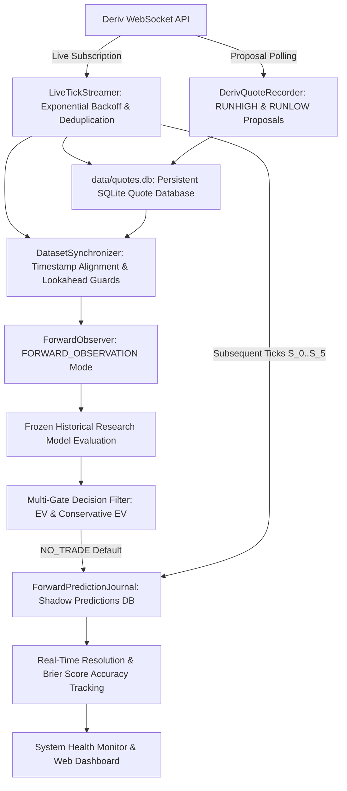

# Deriv 5-Tick Quantitative Research & Real-Market Validation Framework (V1.5.2)


%20%7C%20gaps%20%7C%20quarantine-green)


-red)


A quantitative research and statistical validation framework engineered for Deriv 5-tick contracts, specifically modeling RUNHIGH (Only Ups) and RUNLOW (Only Downs) where every successive tick after the entry spot must move strictly in the chosen direction. The framework formulates trading as a multi-stage statistical hypothesis testing, probability calibration, and live market observation problem: determining under which measurable market conditions, if any, the probability of winning exceeds the break-even probability implied by its actual available payout by a statistically credible and repeatable margin.

---

## Canonical 5-Tick Contract Execution Lifecycle

The production research definition enforces a single canonical contract duration implementation:

```
Signal detected at tick i
       |
Order submitted & processed
       |
Entry Spot S_0 = tick i + 1 (First tick after processing)
       |
  Step 1: S_0 -> S_1 (tick i + 2)
  Step 2: S_1 -> S_2 (tick i + 3)
  Step 3: S_2 -> S_3 (tick i + 4)
  Step 4: S_3 -> S_4 (tick i + 5)
  Step 5: S_4 -> S_5 (tick i + 6, Expiry Spot)
```

### Strict Settlement Rules
- **RUNHIGH (Only Ups)**: Wins if and only if $S_1 > S_0 \land S_2 > S_1 \land S_3 > S_2 \land S_4 > S_3 \land S_5 > S_4$.
- **RUNLOW (Only Downs)**: Wins if and only if $S_1 < S_0 \land S_2 < S_1 \land S_3 < S_2 \land S_4 < S_3 \land S_5 < S_4$.
- **Equality**: Any equality ($=$) at any step results in an immediate contract loss.
- **Reversals**: Any opposing directional tick results in an immediate loss.
- **Insufficient Forward Ticks**: Evaluates to `None` or `NaN`, preventing fabricated outcomes.

---

## Empirical Baseline vs Proposal Benchmark

The engine does not assume theoretical random-walk probability ($3.125\%$). It computes the empirical baseline from historical observations:

$$\text{Theoretical Reference} = (0.5)^5 = 0.03125 = 3.125\%$$

$$\text{Deriv Live Proposal Hurdle (\$2.00 Stake } \to \text{\$61.03 Total Payout)} = \frac{\$2.00}{\$61.03} \approx 3.277\%$$

Empirical results on Volatility 75 (`R_75`, 43,184 ticks, 43,178 contract windows):
- **Empirical $P(\text{RUNHIGH})$**: $3.275\%$ ($SE = 0.0009$, $95\%$ Wald CI: $[3.107\%, 3.443\%]$)
- **Empirical $P(\text{RUNLOW})$**: $2.971\%$ ($SE = 0.0008$, $95\%$ Wald CI: $[2.811\%, 3.132\%]$)

---

## V1.5.2 Architecture & Live Market Integration



---

## V1.5.2 Core Capabilities & Deliverables

### 1. Resilient Live Tick Streaming Service (`live_collector.py`)
- Subscribes to live Deriv market ticks via `{"ticks": symbol, "subscribe": 1}`.
- Bounded exponential backoff reconnection (`1s -> 2s -> 4s -> ... max 30s`).
- Restores active subscriptions automatically upon reconnect.
- Detects duplicate ticks and logs timestamp gap occurrences.
- Ring-buffered memory prevention against unbounded RAM growth.
- Flushes tick observations periodically to `data/<symbol>_live_ticks.csv`.

### 2. Historical Tick Coverage & Integrity Auditing (`collector.py`)
- Full coverage audit utility: `python collector.py --coverage` scanning all datasets in `data/`.
- Resumable checkpointing (`<symbol>_checkpoint.json`) for uninterrupted multi-batch downloads.
- Data quarantine directory (`data/quarantine/`) for corrupt or non-compliant datasets.
- SHA-256 dataset checksums and provenance logging (`<symbol>_provenance.json`).

### 3. Genuine RUNHIGH / RUNLOW Proposal Database (`quote_database.py`)
- Persistent SQLite proposal database (`data/quotes.db`) indexed on `(market_symbol, contract_type, response_timestamp)`.
- Enforces strict lookahead-free querying:
  $$\text{response\_timestamp} \le \text{decision\_timestamp} \le \text{response\_timestamp} + \text{max\_freshness\_seconds}$$
- Captures session IDs, request/response timestamps, latency in milliseconds, ask prices, and payouts.
- CLI commands for inspecting, validating, exporting, and reporting quote coverage.

### 4. Forward Observation Mode (`forward_observer.py`)
- Operating mode: `FORWARD_OBSERVATION`.
- Shadow prediction evaluator applying a frozen historical research model against live streaming ticks.
- Synchronizes tick stream with fresh quotes in real time.
- Enforces strict `NO_TRADE` safety protection (Zero buy orders).
- Accumulates subsequent forward ticks ($S_0 \dots S_5$) to resolve 5-tick contract windows without lookahead.

### 5. Forward Prediction Journal & Accuracy Tracker (`forward_journal.py`)
- SQLite storage (`data/forward_predictions.db`) logging every candidate evaluation.
- Tracks out-of-sample forward Brier score, empirical win rate, and Expected Calibration Error (ECE).
- Reconstructs hypothetical profit/loss without ever claiming real account profits.

### 6. Isolated Demo Settlement Harness (`contract_lifecycle.py`)
- Codifies the formal canonical 5-tick contract lifecycle.
- Isolated demo verification harness protected by `ALLOW_DEMO_EXECUTION = False` default lock.
- Requires explicit operator activation (`--enable-demo-execution`) and `DERIV_DEMO_TOKEN`.
- Compares official Deriv settlement receipts against our reconstructed outcome model.

### 7. Real-Time Health Telemetry (`health_monitor.py`)
- Tracks connection status, tick ingestion rate (ticks/sec), quote success/rejection rates, and storage health.
- Enforces system-wide invariant: `LIVE_EXECUTION_DISABLED = True`.

### 8. Upgraded Dashboard (`dashboard.py`)
- Follows the strict 60-30-10 design system:
  - 60% Dominant Background: Deep Navy (`#0B0F19`)
  - 30% Surface/Panel: Slate Midnight (`#131B2E`)
  - 10% Accent: Vivid Sky Blue (`#0284C7`)
- Vector SVGs throughout (zero emojis).
- Full compliance with Rule 16: Zero development status tags/badges in the UI.

---

## Directory Structure

```
bot_builder/
├── config.py                           # Configuration, .env loading & live payout query
├── collector.py                        # Historical tick downloader, checkpoints & coverage audit
├── live_collector.py                   # Dedicated live tick streamer with backoff reconnection
├── merge_ticks.py                      # Master tick merger, deduplication & conflict halt
├── contract_model.py                   # Canonical Deriv RUNHIGH/RUNLOW lifecycle (Entry i+1 -> Expiry i+6)
├── contract_lifecycle.py               # Formal contract spec & isolated demo verification harness
├── quote_database.py                   # SQLite historical quote database & lookahead-free query engine
├── quote_engine.py                     # Direction-specific quote engine with SQLite DB integration
├── quote_recorder.py                   # Live proposal quote recorder (Dual CSV + SQLite DB)
├── dataset_synchronizer.py             # Timestamp-aware synchronizer with strict lookahead protection
├── forward_journal.py                  # SQLite forward prediction journal & Brier score tracking
├── forward_observer.py                 # FORWARD_OBSERVATION mode service (Shadow predictions)
├── health_monitor.py                   # Operational health telemetry for ticks, quotes & storage
├── negative_control.py                 # Time-series aware negative controls & stage-by-stage FPR tracking
├── market_regime.py                    # Multi-scale feature engineering: streaks, momentum, volatility
├── features.py                         # Feature pipeline, data validation & historical coverage checks
├── strategy.py                         # MarketStateProbabilityModel & setup scoring
├── feature_search.py                   # Systematic grid search, Holm/BH corrections, block bootstrap
├── probability.py                      # Bayesian smoothing, Wilson CIs, block bootstrap, stride-5 sensitivity
├── paper_trader.py                     # Safe paper trading engine (LIVE_EXECUTION_DISABLED = True)
├── risk.py                             # Consecutive-loss cooldowns & UTC daily loss reset
├── backtest.py                         # Probability-driven backtester with quote DB lookup
├── walk_forward.py                     # Purged 3-way split (Train 60% / Val 20% / Holdout 20%)
├── trade_journal.py                    # Granular trade database & performance attribution
├── research.py                         # Cross-sectional multi-symbol hypothesis tester
├── run_edge_research.py                # Single research command executing full 16-stage pipeline
├── dashboard.py                        # Local web dashboard with 60-30-10 UI (http://127.0.0.1:8088)
├── requirements.txt                    # Project dependency manifest
├── .env.example                        # Documented environment variable template
├── reports/
│   ├── V1_5_1_RESEARCH_REPORT.md       # V1.5.1 baseline statistical research report
│   └── V1_5_2_VALIDATION_REPORT.md     # Full V1.5.2 validation report (Sections A-G)
├── tests/                              # Automated test suite (74 passed)
│   ├── test_outcome_rule.py            # Validates entry i+1, exit i+6, ties count as losses
│   ├── test_no_lookahead.py            # Proves zero lookahead bias when future prices change
│   ├── test_null_test.py               # Null hypothesis shuffle test (collapses to baseline)
│   ├── test_risk_and_validation.py     # Validates cooldowns, daily resets & integrity audits
│   ├── test_merge_ticks.py             # Validates deduplication, price conflict stop & gaps
│   ├── test_v11_engine.py              # Validates contract model, quotes, walk-forward
│   ├── test_runhigh_runlow.py          # Validates exact 5-transition RUNHIGH/RUNLOW mechanics
│   ├── test_v13_edge_discovery.py      # Validates grid search, lift, Brier score, BSS, ECE
│   ├── test_v14_edge_validation.py     # Validates 7-gate attribution, true break-even, paper mode
│   ├── test_v15_advanced_validation.py # Validates purged splits, Bayesian shrinkage, Wilson CIs
│   ├── test_v151_statistical_integrity.py # Validates Tuple fix, quote DB, Holm/BH, bootstrap
│   └── test_v152_live_data_and_forward.py # Validates live streaming, forward journal, health monitor,
│                                       # and contract lifecycle settlement rules
└── data/                               # Historical tick storage & provenance logs
    ├── .gitkeep
    ├── quotes.db                       # Persistent SQLite historical quote database
    ├── forward_predictions.db          # Persistent SQLite forward predictions database
    ├── <symbol>_ticks.csv
    ├── <symbol>_master.csv
    ├── <symbol>_provenance.json
    ├── <symbol>_master_provenance.json
    └── quarantine/                     # Quarantined corrupt/unverified datasets
        ├── .gitkeep
        └── quarantine_log.json
```

---

## Command Execution Instructions

### 1. Run Complete Offline Regression Tests (74 Passed)
```bash
python -m pytest -v
```

### 2. Audit All Historical Datasets in Data Directory
```bash
python collector.py --coverage
```

### 3. Start Live Tick Streaming Service
```bash
python live_collector.py R_75 --duration 60
```

### 4. Record Genuine RUNHIGH/RUNLOW Proposals
```bash
python quote_recorder.py R_75 --duration 60 --interval 2
```

### 5. Inspect and Manage Historical Quote Database
```bash
# Coverage summary
python quote_database.py --coverage

# Inspect recent quotes
python quote_database.py --inspect

# Validate database integrity
python quote_database.py --validate

# Export quote records to CSV
python quote_database.py --export data/exported_quotes.csv
```

### 6. Run Forward Observation Mode (Shadow Predictions)
```bash
python forward_observer.py R_75 --duration 120
```

### 7. Run Complete Offline Research & Validation Pipeline
```bash
python run_edge_research.py data/R_75_master.csv
```

### 8. Inspect Operational System Health
```bash
python health_monitor.py
```

### 9. Launch Visual Web Dashboard
```bash
python dashboard.py 8088
```
Navigate to `http://127.0.0.1:8088`.

---

## Safety Directives & Research Verdict

- **Real-Money Trading:** Permanently disabled (`LIVE_EXECUTION_DISABLED = True`).
- **Research Verdict:** `DATA_COLLECTION_IN_PROGRESS` (System remains in strict `NO_TRADE` protection).
- **Economic Hurdle:** No state passes the full confirmatory gate on out-of-sample data. Zero real capital is ever allocated.
