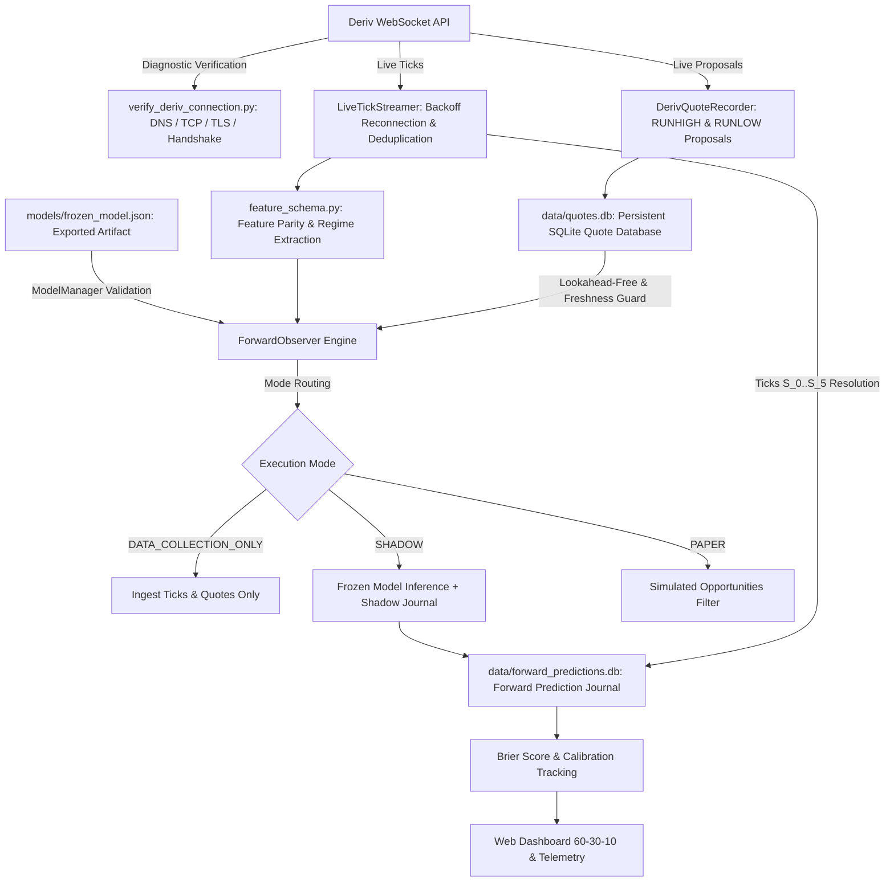

# Deriv 5-Tick Quantitative Research & Real-Market Validation Framework (V1.5.3 Final Patch)


-red)


A rigorous quantitative research, frozen model inference, and forward observation framework engineered for Deriv 5-tick contracts—specifically modeling RUNHIGH (Only Ups) and RUNLOW (Only Downs) where every successive tick after entry spot must move strictly in the chosen direction. The system guarantees scientific reproducibility, eliminates research placeholders, verifies genuine Deriv quote handling, and enforces strict non-purchasing observation protocols.

---

## Canonical 5-Tick Contract Execution Lifecycle

The production framework enforces a single canonical contract duration implementation:

```
Signal detected at tick i
       |
Order submitted & processed
       |
Entry Spot S_0 = tick i + 1 (First tick after processing)
       |
  Step 1: S_0 -> S_1 (tick i + 2)
  Step 2: S_1 -> S_2 (tick i + 3)
  Step 3: S_2 -> S_3 (tick i + 4)
  Step 4: S_3 -> S_4 (tick i + 5)
  Step 5: S_4 -> S_5 (tick i + 6, Expiry Spot)
```

### Strict Settlement Rules
- **RUNHIGH (Only Ups)**: Wins if and only if $S_1 > S_0 \land S_2 > S_1 \land S_3 > S_2 \land S_4 > S_3 \land S_5 > S_4$.
- **RUNLOW (Only Downs)**: Wins if and only if $S_1 < S_0 \land S_2 < S_1 \land S_3 < S_2 \land S_4 < S_3 \land S_5 < S_4$.
- **Equality Rule**: Any equality ($=$) at any step results in an immediate contract loss.
- **Reversal Rule**: Any opposing directional tick results in an immediate contract loss.
- **Incomplete Sequences**: Evaluates to `OUTCOME_UNVERIFIED`, preventing artificial loss attribution.

---

## Empirical Baseline vs Proposal Benchmark

The engine does not assume theoretical random-walk probability ($3.125\%$). It computes the empirical baseline from historical observations:

$$\text{Theoretical Reference} = (0.5)^5 = 0.03125 = 3.125\%$$

$$\text{Deriv Live Proposal Hurdle (\$2.00 Stake } \to \text{\$61.03 Total Payout)} = \frac{\$2.00}{\$61.03} \approx 3.277\%$$

Empirical results on Volatility 75 (`R_75`, 43,184 ticks, 43,178 contract windows):
- **Empirical $P(\text{RUNHIGH})$**: $3.275\%$ ($SE = 0.0009$, $95\%$ Wald CI: $[3.107\%, 3.443\%]$)
- **Empirical $P(\text{RUNLOW})$**: $2.971\%$ ($SE = 0.0008$, $95\%$ Wald CI: $[2.811\%, 3.132\%]$)

---

## V1.5.3 Hotfix Core Architecture & Capabilities



---

## Key Improvements in V1.5.3 Hotfix

### 1. Regression Test Repairs
- **Metric Restoration**: Restored `runhigh_observed_win_rate`, `runlow_observed_win_rate`, `runhigh_brier_score`, and `runlow_brier_score` in [forward_journal.py](file:///d:/workspace_programming/bot_builder/forward_journal.py).
- **Recent Record Inspection**: Restored `inspect_recent(limit=10, symbol=None)` returning sanitized prediction dictionaries without leaking credentials.
- **Full Test Passing**: All 74 existing regression tests pass with 10 new integration tests (84 total).

### 2. Frozen Model Artifact System ([model_artifact.py](file:///d:/workspace_programming/bot_builder/model_artifact.py) & [model_manager.py](file:///d:/workspace_programming/bot_builder/model_manager.py))
- JSON-based frozen model serialization format recording dataset provenance, SHA256 checksums, hyperparameters, empirical state tables, and calibration metadata.
- Strict model validation gates returning explicit status codes:
  - `MODEL_NOT_FOUND`
  - `MODEL_CORRUPTED`
  - `MODEL_SCHEMA_MISMATCH`
  - `MODEL_SYMBOL_MISMATCH`
  - `MODEL_CONTRACT_MISMATCH`
  - `MODEL_UNVALIDATED`
  - `MODEL_UNCALIBRATED`
  - `MODEL_VALIDATED`
- Explicit status taxonomy: `RESEARCH_ONLY`, `TRAINED`, `VALIDATION_FAILED`, `HOLDOUT_FAILED`, `CALIBRATION_FAILED`, `CANDIDATE`, `VALIDATED_RESEARCH`, `FORWARD_VALIDATION_PENDING`, `FORWARD_VALIDATED`.
- Models with `RESEARCH_ONLY` status are barred from paper trade qualification.

### 3. Elimination of Hardcoded Probabilities & Benchmark Fallbacks
- Probabilities are evaluated strictly from the loaded frozen `ModelArtifact`. Hardcoded constants ($3.275\%$, $2.971\%$, $6.80\%$) are completely eliminated.
- Historical benchmark payout fallbacks ($2.00 \to \$61.03$) are eliminated from forward observation and paper trading.
- When quotes are missing from the SQLite database:
  - Returns `QUOTE_UNAVAILABLE`.
  - Sets ask price, payout, break-even probability, and EV to `None` (null).
  - Enforces `decision = "NO_TRADE"`.

### 4. Deterministic Feature Parity ([feature_schema.py](file:///d:/workspace_programming/bot_builder/feature_schema.py))
- Defines canonical feature names (`mom_bin`, `streak_bin`, `vol_bin`, `accel_bin`) and schema version `1.5.3`.
- Guarantees mathematical parity between historical batch training feature extraction and online sliding window calculation.

### 5. Multi-Mode Forward Observer ([forward_observer.py](file:///d:/workspace_programming/bot_builder/forward_observer.py))
- **`DATA_COLLECTION_ONLY`**: Records ticks and proposal quotes, resolves forward windows, requires no prediction model.
- **`SHADOW`**: Loads frozen models (including `RESEARCH_ONLY`), evaluates probabilities and EV, journals predictions, enforces strict non-trading.
- **`PAPER`**: Simulates trades only when all qualification gates pass (approved model, fresh quotes, positive conservative EV).

### 6. Live Deriv API Diagnostic Tool ([verify_deriv_connection.py](file:///d:/workspace_programming/bot_builder/verify_deriv_connection.py))
- Multi-stage diagnostic separating low-level network failures:
  - DNS resolution (IPv4 addresses, latency)
  - TCP handshake (Port 443 connect latency)
  - TLS 1.3 handshake (Strict certificate verification)
  - WebSocket handshake (Accurately classifies HTTP 520 Cloudflare edge errors)
- Persists detailed diagnostic reports to [reports/deriv_api_diagnostic.json](file:///d:/workspace_programming/bot_builder/reports/deriv_api_diagnostic.json).

### 7. Quote Database Inspection Utility ([quote_database.py](file:///d:/workspace_programming/bot_builder/quote_database.py))
- Added `--inspect` CLI command displaying record counts, RUNHIGH/RUNLOW breakdown, observation timestamps, and database health.
- Explicitly outputs `NO_GENUINE_QUOTES_RECORDED` on empty databases.

### 8. Updated Web Dashboard ([dashboard.py](file:///d:/workspace_programming/bot_builder/dashboard.py))
- Strict 60-30-10 design system (#0B0F19 background, #131B2E surface, #0284C7 accent).
- SVGs throughout (zero emojis).
- Full compliance with Rule 16: Zero development status tags or badges.
- Live panels for Frozen Model ID, API Diagnostic Status, Actual Quotes (Null when unavailable), and Forward Shadow Predictions.

---

## Directory Structure

```
bot_builder/
├── config.py                           # Configuration, .env loading & API defaults
├── collector.py                        # Historical tick downloader, checkpoints & coverage audit
├── live_collector.py                   # Dedicated live tick streamer with backoff reconnection
├── merge_ticks.py                      # Master tick merger, deduplication & conflict halt
├── contract_model.py                   # Canonical Deriv RUNHIGH/RUNLOW lifecycle (Entry i+1 -> Expiry i+6)
├── contract_lifecycle.py               # Formal contract spec & isolated demo verification harness
├── feature_schema.py                   # Explicit feature schema & offline/online parity engine
├── model_artifact.py                   # ModelArtifact dataclass, SHA256 hashing & JSON serialization
├── model_manager.py                    # Model validation, loading, qualification & baseline export
├── quote_database.py                   # SQLite proposal quote database with --inspect command
├── quote_engine.py                     # Direction-specific quote engine with strict fallback guards
├── quote_recorder.py                   # Live proposal quote recorder (Dual CSV + SQLite DB)
├── dataset_synchronizer.py             # Timestamp-aware synchronizer with strict lookahead protection
├── forward_journal.py                  # SQLite forward prediction journal & accuracy metrics
├── forward_observer.py                 # Multi-mode forward observation engine (DATA_COLLECTION, SHADOW, PAPER)
├── verify_deriv_connection.py          # Live Deriv API connection & network diagnostic tool
├── health_monitor.py                   # Operational health telemetry for ticks, quotes & storage
├── negative_control.py                 # Time-series aware negative controls & stage-by-stage FPR tracking
├── market_regime.py                    # Multi-scale feature engineering: streaks, momentum, volatility
├── features.py                         # Feature pipeline, data validation & historical coverage checks
├── strategy.py                         # MarketStateProbabilityModel & setup scoring
├── feature_search.py                   # Systematic grid search, Holm/BH corrections, block bootstrap
├── probability.py                      # Bayesian smoothing, Wilson CIs, block bootstrap, stride-5 sensitivity
├── paper_trader.py                     # Safe paper trading engine (LIVE_EXECUTION_DISABLED = True)
├── risk.py                             # Consecutive-loss cooldowns & UTC daily loss reset
├── backtest.py                         # Probability-driven backtester with quote DB lookup
├── walk_forward.py                     # Purged 3-way split (Train 60% / Val 20% / Holdout 20%)
├── run_edge_research.py                # Research pipeline generating validation and hotfix reports
├── dashboard.py                        # Local web dashboard with 60-30-10 UI (http://127.0.0.1:8088)
├── decision_gate.py                    # Centralized paper trade eligibility gate & reason codes
├── requirements.txt                    # Project dependency manifest
├── .env.example                        # Documented environment variable template
├── .gitignore                          # Git tracking exclusions (excludes .agents/ per Rule 22)
├── models/                             # Frozen model artifact JSON storage
│   ├── .gitkeep
│   └── M_R_75_5TICK_20261008_132512.json
├── reports/
│   ├── deriv_api_diagnostic.json       # Live API diagnostic results
│   ├── V1_5_1_RESEARCH_REPORT.md       # V1.5.1 baseline statistical research report
│   ├── V1_5_2_VALIDATION_REPORT.md     # V1.5.2 validation report
│   ├── V1_5_3_VALIDATION_REPORT.md     # V1.5.3 validation report
│   ├── V1_5_3_HOTFIX_REPORT.md         # V1.5.3 hotfix validation report
│   └── V1_5_3_FINAL_PATCH_REPORT.md    # V1.5.3 final patch safety and connectivity report
├── tests/                              # Automated test suite (97 passed)
│   ├── test_outcome_rule.py
│   ├── test_no_lookahead.py
│   ├── test_null_test.py
│   ├── test_risk_and_validation.py
│   ├── test_merge_ticks.py
│   ├── test_v11_engine.py
│   ├── test_runhigh_runlow.py
│   ├── test_v13_edge_discovery.py
│   ├── test_v14_edge_validation.py
│   ├── test_v15_advanced_validation.py
│   ├── test_v151_statistical_integrity.py
│   ├── test_v152_live_data_and_forward.py
│   ├── test_v153_hotfix_validation.py  # V1.5.3 hotfix regression and integration tests
│   └── test_v153_final_patch.py        # V1.5.3 final patch safety and connectivity tests
└── data/                               # Historical tick storage & provenance logs
    ├── .gitkeep
    ├── quotes.db                       # Persistent SQLite historical quote database
    ├── forward_predictions.db          # Persistent SQLite forward predictions database
    ├── <symbol>_ticks.csv
    ├── <symbol>_master.csv
    ├── <symbol>_provenance.json
    ├── <symbol>_master_provenance.json
    └── quarantine/
        ├── .gitkeep
        └── quarantine_log.json
```

---

## Command Execution Instructions

### 1. Run Complete Automated Test Suite (97 Passed)
```powershell
python -m pytest -v
```

### 2. Verify Live Deriv API Connection
```powershell
python verify_deriv_connection.py --symbol R_75 --timeout 6.0
```

### 3. Inspect Exported Frozen Models
```powershell
# Train and export a frozen model from historical dataset
python model_manager.py --train data/R_75_master.csv --symbol R_75

# Inspect exported model artifact
python model_manager.py --inspect models/M_R_75_5TICK_20261008_132512.json
```

### 4. Inspect Historical Quote Database
```powershell
python quote_database.py --inspect
```

### 5. Start Forward Observation Engine
```powershell
# DATA_COLLECTION_ONLY mode (records ticks and quotes without model predictions)
python forward_observer.py R_75 --mode DATA_COLLECTION_ONLY --duration 120

# SHADOW mode (evaluates frozen model predictions, journals decisions, zero trading)
python forward_observer.py R_75 --mode SHADOW --duration 120

# PAPER mode (simulates trades only if model is approved and genuine quotes exist)
python forward_observer.py R_75 --mode PAPER --duration 120
```

### 6. Record Live Quotes and Stream Ticks
```powershell
# Stream live ticks
python live_collector.py R_75 --duration 60

# Record RUNHIGH/RUNLOW proposal quotes
python quote_recorder.py R_75 --duration 60 --interval 2.0
```

### 7. Run Research & Generate Validation Reports
```powershell
python run_edge_research.py data/R_75_master.csv
```

### 8. Launch Web Dashboard
```powershell
python dashboard.py 8088
```
Navigate to `http://127.0.0.1:8088`.

---

## Safety Directives & Final Verdict

- **Real-Money Trading:** Permanently disabled (`LIVE_EXECUTION_DISABLED = True`).
- **Research Verdict:** `SHADOW_VALIDATION_READY` & `LIVE_DATA_COLLECTION_READY` (System enforces strict `NO_TRADE` until a frozen model with positive conservative EV after holdout testing is validated).
- **Economic Hurdle:** All forward predictions are traceable to frozen models; financial calculations require genuine available quotes. Zero real capital is ever allocated.
